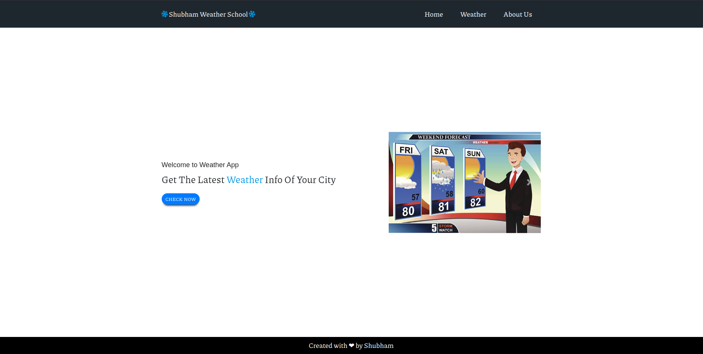
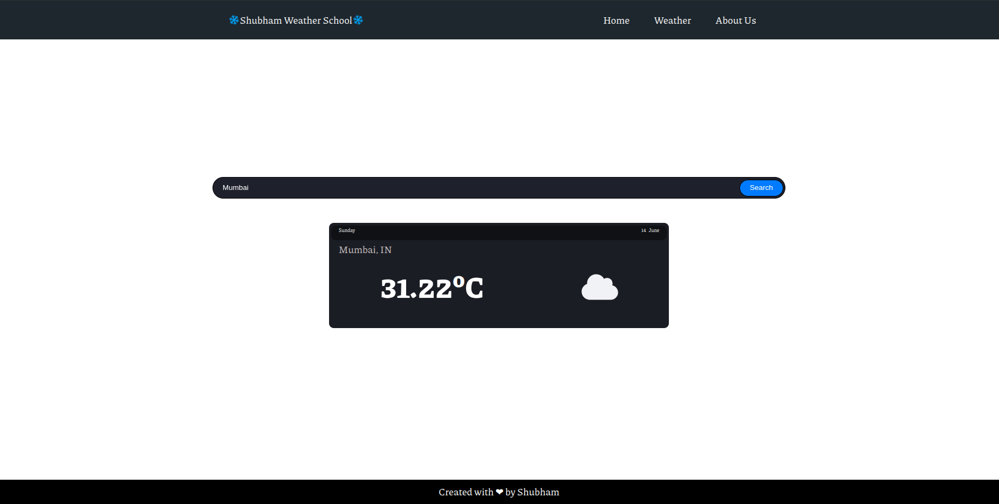
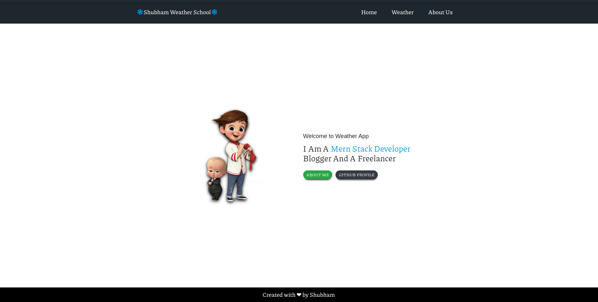

# 🌦️ Weather App

A responsive weather application built using **Node.js**, **Express.js**, **Handlebars (HBS)**, **HTML**, **CSS**, and **JavaScript**. The application fetches real-time weather data using the OpenWeather API and displays current weather conditions for any city worldwide.

## 🚀 Live Demo

🔗 Live Website: https://weather-app-d87o.onrender.com/

## 📂 GitHub Repository

🔗 Repository: https://github.com/CodeWithShubz/Weather-App

## ✨ Features

* Search weather by city name
* Real-time weather information
* Current temperature in Celsius
* Dynamic weather icons
* Invalid city name validation
* Responsive user interface
* About page with portfolio links
* Error handling for API failures

## 🛠️ Technologies Used

* Node.js
* Express.js
* Handlebars (HBS)
* HTML5
* CSS3
* JavaScript
* OpenWeather API

## 📸 Screenshots

### Home Page



### Weather Search



### About Page



## 📦 Installation

Clone the repository:

```bash
git clone https://github.com/CodeWithShubz/Weather-App.git
```

Navigate to the project folder:

```bash
cd Weather-App
```

Install dependencies:

```bash
npm install
```

Start the application:

```bash
npm start
```

Open your browser and visit:

```text
http://localhost:8000
```

## 📁 Project Structure

```text
Weather-App/
│
├── public/
│   ├── css/
│   ├── images/
│   └── js/
│
├── src/
│   └── app.js
│
├── templates/
│   ├── partials/
│   └── views/
│
├── package.json
└── README.md
```

## 🎯 Learning Outcomes

This project helped me learn:

* Express.js routing
* Handlebars templating engine
* API integration using Fetch API
* Error handling in JavaScript
* Dynamic DOM manipulation
* Deploying Node.js applications on Render
* Git and GitHub workflow

## 👨‍💻 Author

**Shubham Tivarekar**

GitHub: https://github.com/CodeWithShubz

## ⭐ Support

If you found this project useful, consider giving the repository a star.
